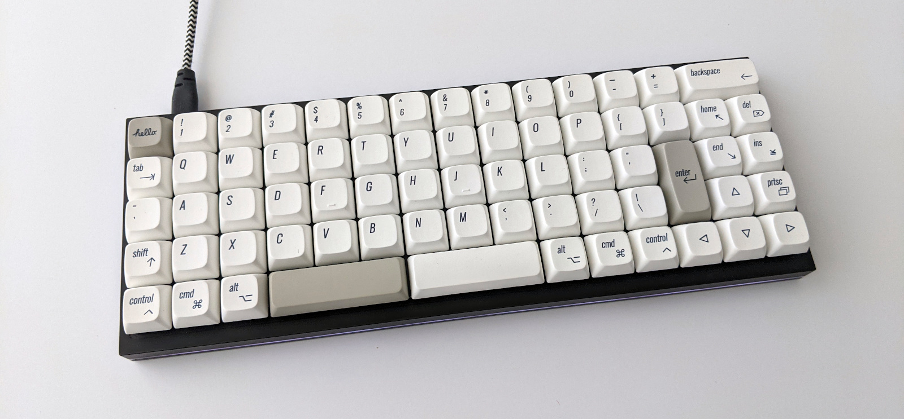
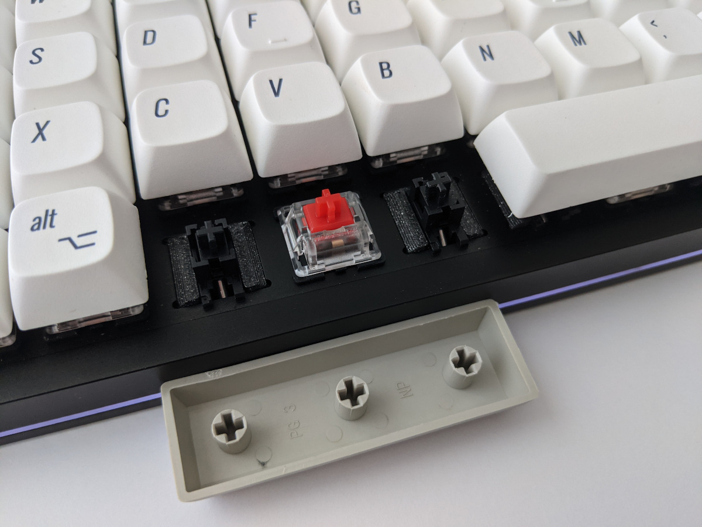
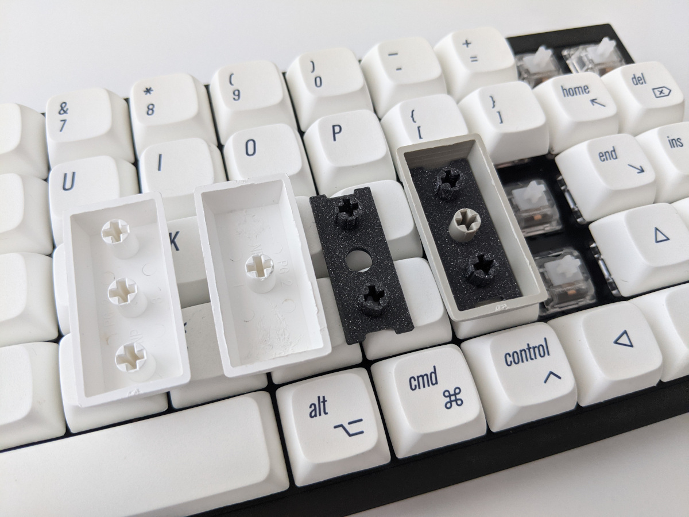

# ID69

An ID75 ortholinear keyboard with two 3u spacebars and 2u Enter and Backspace keys.

## Hardware

A couple extra parts are used to mount the non-1u keycaps without having to modify the case or PCB.

3d printed holders are used to fit plate-mounted 3u stabilizers into the 1u switch holes for the split spacebar.

A 3d printed adapter is used to mount regular 2u keys POS style on 2 switches. Unfortunately this requires clipping the keycap stab posts (but that should be functionally reversible with another adapter if needed).

## Firmware

The firware is the default `idobo` QMK keyboard compiled with a custom keymap as a `LAYOUT_ortho_5x15` layout to account for the modified/missing keys.
